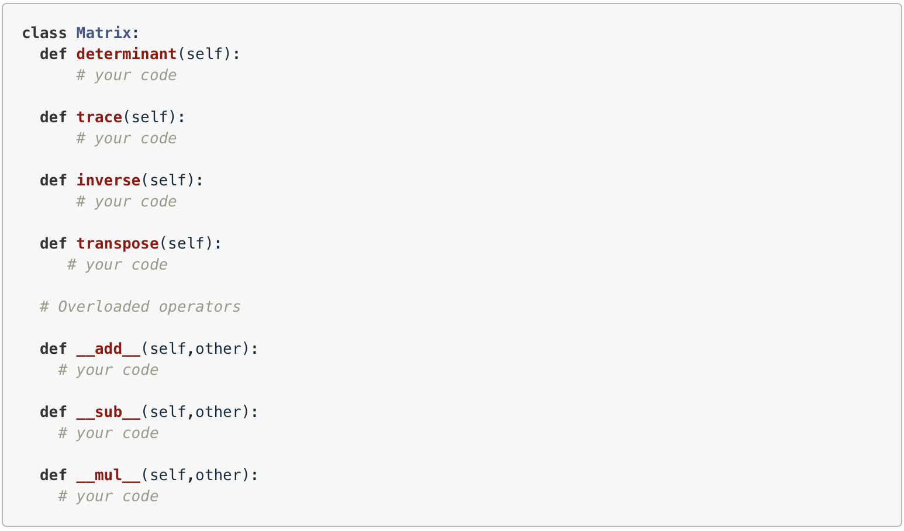
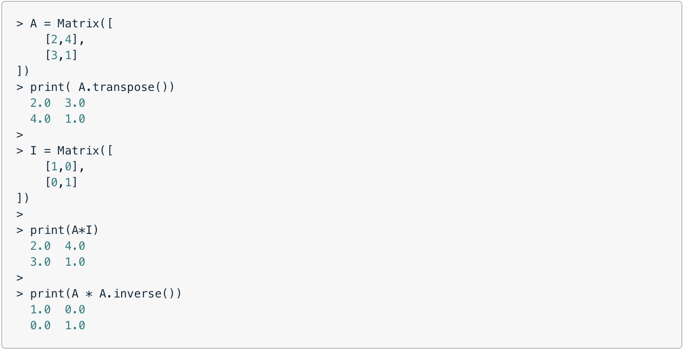

## Implement a Matrix Class

Use an object-oriented programming and matrices to build matrix and vector classes.

In this project you will implement a `Matrix` class in Python. Specifically, you will implement the following methods:

When the class is working properly you will be able to manipulate matrices in code as if they were regular numbers (for the most part). For example:

